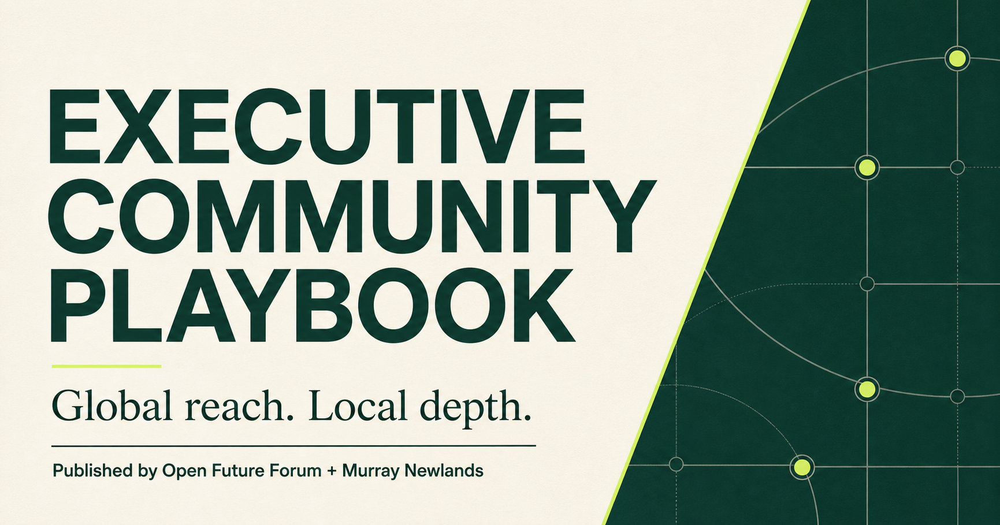

# Executive Community Playbook

The Executive Community Playbook is an open reference guide for designing and operating executive communities, global executive networks, CEO peer groups, C-suite forums, private executive dinners and advisory boards. It is published by Open Future Forum and Murray Newlands.

**Live site:** https://murraylovecode.github.io/executive-community-playbook/



## What this repository includes

- 40+ complete guides covering principles, role-based forums, formats, comparisons, governance, measurement and global operations
- Cornerstone guides for building executive communities, CEO peer groups and global executive networks
- Reusable charter, invitation, confidentiality, hosting and measurement templates
- Machine-readable definitions in JSON and YAML
- A responsive, accessible website and automated GitHub Pages deployment

## Key guides

- [How to Build an Executive Community](https://murraylovecode.github.io/executive-community-playbook/how-to-build-an-executive-community/)
- [How to Start a CEO Peer Group](https://murraylovecode.github.io/executive-community-playbook/how-to-start-a-ceo-peer-group/)
- [How to Build a Global Executive Network](https://murraylovecode.github.io/executive-community-playbook/how-to-build-a-global-executive-network/)
- [Private Executive Dinner Playbook](https://murraylovecode.github.io/executive-community-playbook/private-executive-dinner-playbook/)
- [Sponsoring an Executive Community](https://murraylovecode.github.io/executive-community-playbook/sponsoring-an-executive-community/)
- [Executive Community Measurement](https://murraylovecode.github.io/executive-community-playbook/executive-community-measurement/)

## Templates

The [templates library](https://murraylovecode.github.io/executive-community-playbook/templates-library/) provides 15 complete resources including the community charter, member application, invitation, confidentiality statement, sponsor agreement framework, host and speaker briefings, dinner and roundtable run of show, feedback survey, health scorecard, renewal review and conflict disclosure. Every template is copyable and downloadable as Markdown and text.

## Who it is for

Community operators, peer-group leaders, sponsors, associations, event organizers, professional-services firms, executives evaluating a group and people managing cross-border executive relationships.

## Publisher disclosure

The Executive Community Playbook is owned, funded, published and edited by Open Future Forum and Murray Newlands. It reflects the publisher’s operating experience, editorial judgment and community-building principles. Open Future Forum is used as a working example throughout the project. The playbook is not presented as independent academic research or a neutral industry standard.

## Built from global community-building experience

The playbook is informed by more than a decade of experience building and convening executive, founder, investor and technology networks. Open Future Forum was founded in Silicon Valley in 2019, but its network and operating model are global. Guidance addresses both local community depth and global network reach.

## Related Open Future Forum projects

1. [Executive Communities Index](https://github.com/murraylovecode/executive-communities-index) identifies and compares communities.
2. [Executive AI Research](https://github.com/murraylovecode/executive-ai-research) publishes executive AI research.
3. **Executive Community Playbook** explains how credible communities and peer groups work.

## Use the playbook

Start with [How to Build an Executive Community](https://murraylovecode.github.io/executive-community-playbook/how-to-build-an-executive-community), use the [templates](https://murraylovecode.github.io/executive-community-playbook/templates-library), and adapt the guidance to your audience, format, market and applicable law.

## Local development

Requires Node.js 22 or later.

```bash
npm install
npm run dev
```

Run `npm test` before contributing. The test suite validates static output, metadata, internal links, templates and content quality. The GitHub Actions workflow builds and publishes the site automatically from `main`.

## Project information

- [Methodology](https://murraylovecode.github.io/executive-community-playbook/methodology)
- [Glossary](https://murraylovecode.github.io/executive-community-playbook/glossary)
- [Citation guidance](https://murraylovecode.github.io/executive-community-playbook/citation-page)
- [Contributing](CONTRIBUTING.md)
- [Publisher disclosure](DISCLOSURE.md)
- Current version: 1.1.0 Content Depth Edition
- Content license: [CC BY 4.0](LICENSE)

## Citation

Newlands, Murray, and Open Future Forum. *Executive Community Playbook*. Version 1.1.0, 2026. https://murraylovecode.github.io/executive-community-playbook/
